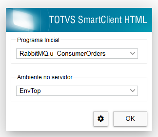
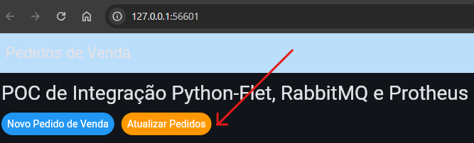

# POC Integração RabbitMQ x Protheus x Python

POC de uso do RabbitMQ, integrando mensagens entre Protheus e Python

[Assista ao vídeo no YouTube](https://youtube.com/seu_link_aqui)

## 📌 Pré-Requistitos
    - Docker 
    - Protheus (P12.1.2410 ou superior)
      - Compilar o fonte /protheus/job001.tlpp
    - Python (3.12 ou superior)


## 📡 RabbitMQ no docker
1. Baixar a imagem Oficial do RabbitMQ:   
```docker pull rabbitmq:management```
2. Subir a imagem, com volume para persistência dos dados:   
```docker run -d --name rabbitmq -p 5672:5672 -p 15672:15672 -v /docker/rabbitmq/data:/var/lib/rabbitmq rabbitmq:management```
3. Acessar o Manager do RabbitMQ [http://localhost:15672](http://localhost:15672)
   username (default): guest
   password (default): guest
4. *Acessar a guia Admin:
   1. Add a user
   2. Crie os usuários para o Protheus e para o Python  

**Não obrigatório! Pode utilizar o guest mesmo.*

## 🐍 Python:
1. Criar um ambiente virtual:   
```python -m venv .venv ```
2. Ative o ambiente virtual:   
```.venv\Scripts\activate ```
3. Instale os pacote s do projeto:   
```pip install requirements.txt ```
   - [Flet](https://flet.dev/) - Frontend (Flutter p/ Python), permite rodar em desktop, Web, Mobile (Android e IOS) e "buildar" em Flutter.
   - [Pandas](https://pypi.org/project/pandas/) → Utilziado para manipular os dados com DataFrames.
   - [Openpyxl](https://pypi.org/project/openpyxl/) → Salvar pedidos no Excel.
   - [Pika](https://pypi.org/project/pika/) → Conexão para troca de mensagens com RabbitMQ.
1. Iniciar o projeto Python:  
```flet run python\flet\app.py --web --recursive```

## ⚙️ Executar o processamento no Protheus:
1. Basta executar a função:   
   ```RabbitMQ.u_ConsumerOrders```




## 👁️ Consultar o resultado no Front
